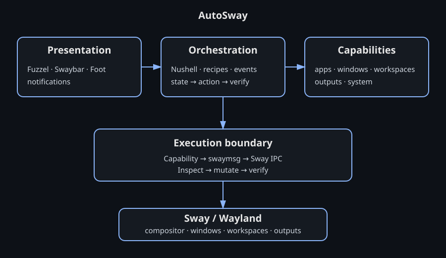

# AutoSway

AutoSway is a small, scriptable desktop-automation layer for Sway.

It combines **Sway IPC**, **Nushell**, **Fuzzel**, **Swaybar**, and optional **Goose** recipes. The goal is simple: keep Sway itself small, expose useful capabilities as deterministic commands, and compose them into reusable desktop workflows.

## Quickstart

Requirements:

- Sway + Wayland
- Nushell 0.90+
- \`swaymsg\`
- \`fuzzel\` for the launcher
- \`foot\` for the example terminal workflow
- \`gio\`/GLib for launching \`.desktop\` applications
- \`swaylock\` for the lock capability
- Goose is optional

Install:

\`\`\`bash
nu scripts/install.nu
\`\`\`

Start using AutoSway:

\`\`\`bash
autosway state workspaces
autosway state outputs
autosway state tree
autosway workspace 1
autosway launch foot
\`\`\`

Add the optional launcher and status bar:

\`\`\`ini
bindsym $mod+d exec autosway-launcher
bar {
    status_command autosway-status
}
\`\`\`

See [docs/BOOTSTRAP.md](docs/BOOTSTRAP.md) for setup.

## Architecture

\`\`\`text
Presentation          Orchestration          Capabilities
 Fuzzel                 Nushell              Applications
 Swaybar                Recipes              Windows
 Notifications          Events               Workspaces
      \                   |                  Outputs
       \                  |                 System
        \                 |                   /
         └──────────── AutoSway ─────────────┘
                          |
                    Capability layer
                          |
                       swaymsg
                          |
                       Sway IPC
                          |
                         Sway
\`\`\`

## Workflow

\`\`\`text
Discover state
     ↓
Select capability / recipe
     ↓
Execute smallest required action
     ↓
Verify resulting state
     ↓
Report result
\`\`\`

For events:

\`\`\`text
Sway IPC event → event router → policy/recipe
       → capability → swaymsg → verify
\`\`\`

## Components

- **Launcher:** category-first Fuzzel UI backed by XDG \`.desktop\` metadata.
- **Status:** independent Nushell widgets rendered through Swaybar's i3bar JSON protocol.
- **Capabilities:** explicit commands for state, windows, workspaces, outputs, launching, and locking.
- **Recipes:** declarative workflows that compose capabilities.
- **Events:** opt-in Sway IPC event stream.
- **Agent boundary:** Goose can orchestrate recipes without unrestricted generated \`swaymsg\`.

## Repository layout

\`\`\`text
autosway/
├── bin/
├── capabilities/
├── launcher/
├── widgets/
├── status/
├── recipes/
├── events/
├── config/
├── docs/
└── scripts/
\`\`\`

## Design principles

1. Sensible defaults.
2. One job per component.
3. State before action.
4. Verify after mutation.
5. Explicit capabilities.
6. Recipes express intent; deterministic code executes it.

## Status

Bootstrap / experimental.